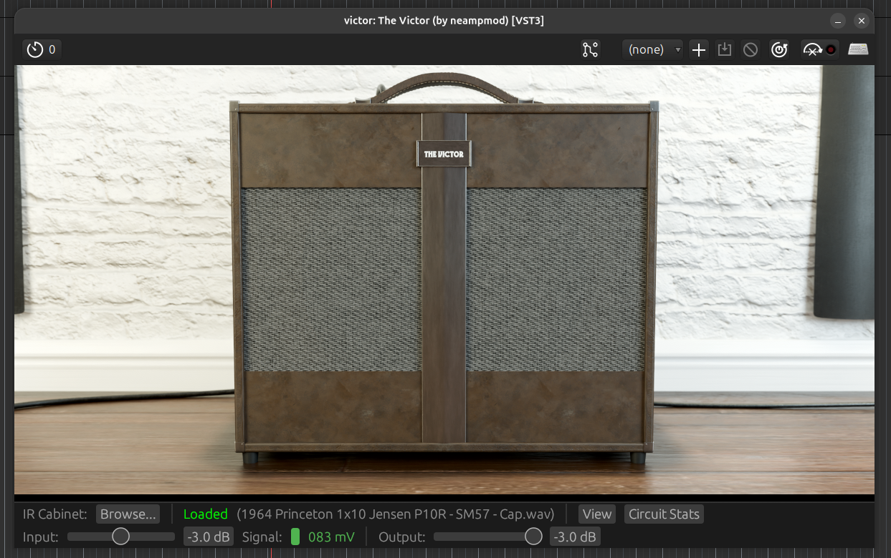
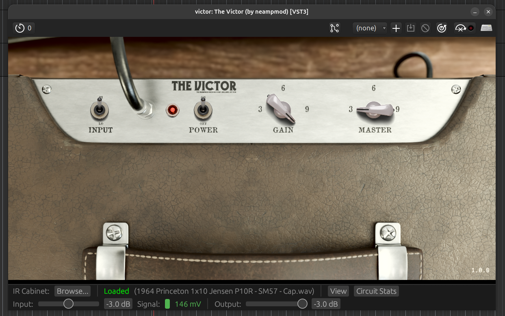
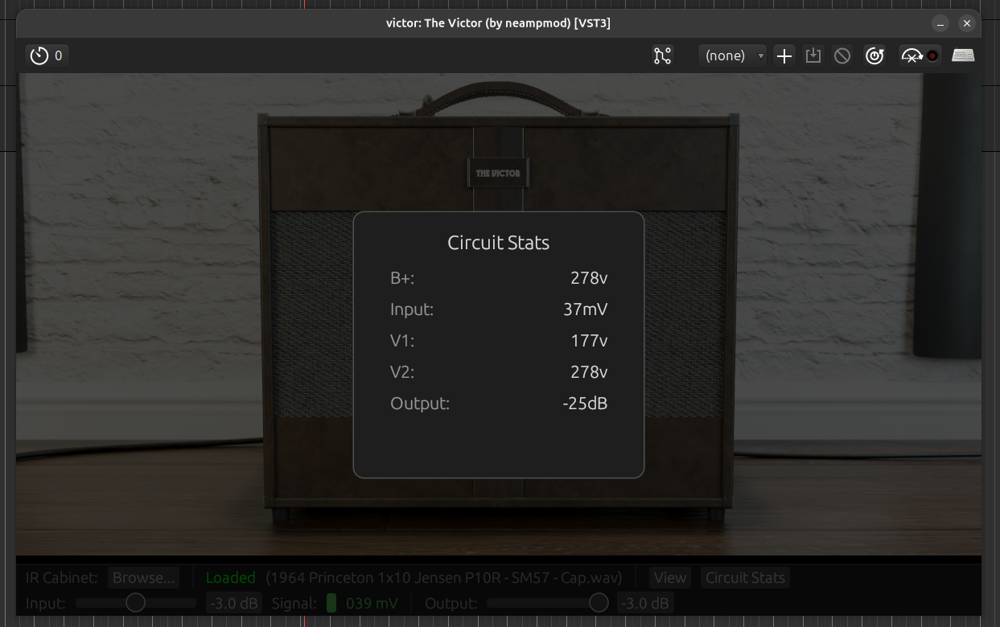

# NEAMPMOD The Victor

The Victor is a circuit-level simulation inspired by the 1950's era Fender® Champ 5C1 amplifier.

* The preamp tube is a General Electric 6SJ7 in Pentode mode (Spline).
* The poweramp tube is a General Electric 6V6GT (Spline).
* The rectifier tube is a Generic 5Y3 (Koren).
* The speaker impedence modelling assumes a Jensen® P8R speaker.

    

    

    
</div

## Controls

### Input Toggle

Toggles between the two available input jacks.

* Input `Hi` is full signal.
* Input `Lo` has around a -6dB signal attentuation.

### Power Toggle

Turns the amp DSP `on`/ `off` - Note the plugin does not passthru signal when `off`.

### Gain Knob

Controls the signal level between 6SJ7 preamp and the 6V6GT poweramp; The preamp is always at max gain.

### Master Knob

Linear fine-tuning volume control at end of circuit after IR, this does not impact gain / tone.

### IR Load (Browse Button)

Opens an OS-native file window, navigate to your IR WAV file and load it.

NOTE: The included `default.wav` has audio artifacts/ is low-quality and should be replaced, see below for suggestions on free IRs.

### Input / Output Trim

See the `Gain Setup` section.

### View

Switches between viewing the front of the amplifiers and the amplifiers top control panel.

You may ask what is the point? I was too pleased with the Blender model not to include the render.

### Circuit Stats

Shows the simulated voltage levels within the amp, the `V1` and `V2` are the B+ node voltages, not the plates.

## Using the Plugin

The Victor is available in VST3 and CLAP plugin formats for Linux and Windows.

To install the plugins copy the `.vst3` to your VST3 directory, and likewise to your `.clap` directory for
the CLAP plugin.

The plugin includes a `default.wav` IR file, I strongly suggest loading a higher quality IR file to get
the best out of the plugin; The following sources provide excellent impulse response files:

* [Origin Effects IR Cab Library](https://origineffects.com/product/ir-cab-library/)
* [Tone3000](https://tone3000.com/)

### Tone3000 IR Files

I would suggest searching for Fender / Jensen IRs on [Tone3000](https://tone3000.com/), there are a range of high-quality IRs with multiple microphones, and microphone positions.

## Gain Setup

The `Signal` level meter displays the signal voltage as the simulated amplifier's input jack would see it. 

Expected voltage ranges by pickup type:

* Passive single-coils: 80 - 150mV moderate playing, 200–350mV hard attack
* Passive humbuckers: 150 - 350mV moderate playing, 400–700mV hard attack
* Active pickups: 500mV - 1.5V

### Calibration workflow

* Set your interface gain so hard playing peaks are comfortable and well below the clip LED — around -12 to -18 dBFS in your DAW if visible
* Play normally across your full dynamic range
* Use the input trim to bring the meter into the expected range for your pickup type
  * If the signal sits consistently above the expected range, reduce trim — you are driving the first tube stage harder than the real circuit would be driven
  * If it sits below, increase trim or add interface gain

Where the signal lands on the meter determines where `V1` operates on its transfer curve — too high and the amp
will behave as if a boost pedal is already in the chain; too low and you will lose the touch sensitivity that emerges near the operating point.

## Reporting Issues

Please raise a GitHub issue with the following:

* Hardware and OS information
* Digital Audio Workstation (DAW) and version
* Description of issue
* Description of how to reproduce the issue

## Links to Useful Information

I have referenced Fender amplifier schematics from EL34 world.

* [EL34World](https://el34world.com/charts/Schematics/files/Fender/Fender_Schematics.htm)

## Author

* Daniel Wray

## License and Legal Information

This code is released under the [GNU GPLv3 license](LICENSE).

The binaries (VST3, CLAP) arereleased under a [Freeware EULA license](BINARY_LICENSE).

* Fender® is a registrated trademark of Fender Musical Instruments Corporation.
* VST® is a registered trademark of Steinberg Media Technologies GmbH.